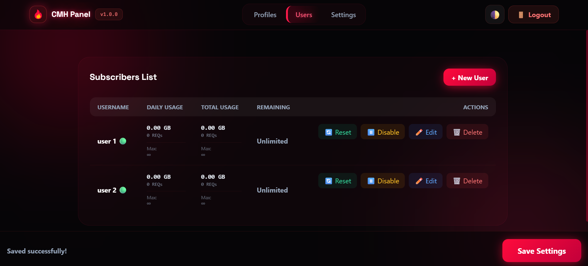
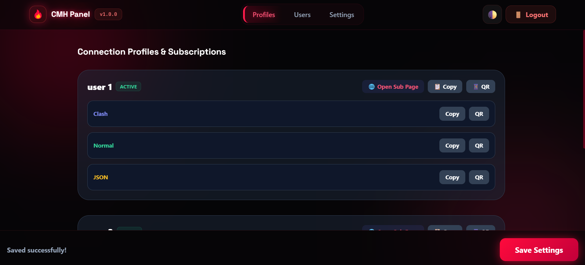
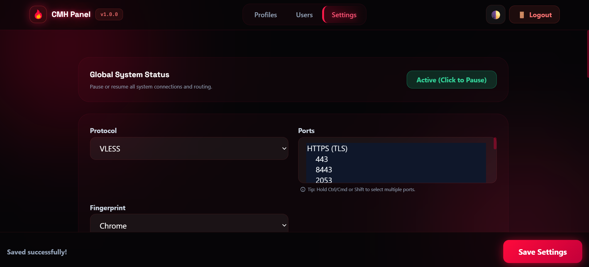

# 🚀 CMH Panel (v2.1.0)

<p align="center">

🌐 **زبان‌ها**

**🇮🇷 فارسی** • [🇺🇸 English](README.md)

</p>

<p align="center">
  
  
  
  
</p>

---

## 📑 فهرست مطالب

- [معرفی](#-معرفی)
- [مستندات جامع](#-مستندات-جامع)
- [ویژگی‌های کلیدی](#-ویژگیهای-کلیدی)
- [معماری](#️-معماری)
- [تصاویر](#-تصاویر)
- [راهنمای نصب سریع](#-راهنمای-نصب-سریع)
- [فلسفه طراحی](#-فلسفه-طراحی)
- [قدردانی](#-قدردانی)
- [مجوز](#-مجوز)

---

## 📖 معرفی

CMH Panel یک پنل مدیریت پروکسی قدرتمند، سبک و مقیاس‌پذیر است که کاملاً بر پایه **Cloudflare Workers** و **Cloudflare D1** ساخته شده است.

با انتشار **v2.1.0**، CMH Panel به یک **سیستم مدیریت کلاستر** کامل تبدیل شده و **معماری Master-Edge** را معرفی می‌کند. اکنون می‌توانید یک نود Master برای مدیریت دیتابیس و رابط کاربری، و چندین نود Edge به عنوان لود بالانسر راه‌اندازی کنید — که عملیات خواند/نوشتن دیتابیس را به شدت کاهش داده و ترافیک بالا را به خوبی مدیریت می‌کند.

---

## 📚 مستندات جامع

> **💡 برای درک بهتر تنظیمات نیاز به راهنما دارید؟**
> یک راهنمای آفلاین کامل در این مخزن گنجانده شده است.
>
> کافی است فایل **`Help.html`** را در مرورگر خود باز کنید تا توضیحات کامل هر بخش از پنل را مطالعه کنید؛ از جمله راه‌اندازی Edge Nodeها، تنظیمات Fragment، محدودیت‌های کاربری و ویژگی‌های ربات تلگرام.

---

## ✨ ویژگی‌های کلیدی

### 🏢 معماری کلاستر Master-Edge *(جدید در v2.1.0)*

- **نود Master:** هاب مرکزی برای رابط کاربری، مدیریت دیتابیس و مسیریابی سابسکریپشن.
- **نودهای Edge:** لود بالانسرهای پروکسی که ترافیک را مدیریت کرده و با Master همگام‌سازی می‌شوند.
- **کش هوشمند:** نودهای Edge از Cache API کلودفلر استفاده می‌کنند تا پروفایل‌ها را بدون نیاز به درخواست مداوم از Master، فوری بارگذاری کنند.
- **گزارش‌دهی دسته‌ای مصرف:** نودهای Edge مصرف ترافیک (بیش از ۱۰۰ درخواست) را دسته‌بندی کرده و سپس به Master ارسال می‌کنند — تا **۱۰۰ برابر** کاهش در عملیات نوشتن D1.

### 🛡️ پروکسی و اتصالات

- پشتیبانی از VLESS (آلفا) و Trojan (بتا) از طریق WebSocket.
- مسیریابی سفارشی هوشمند و تفکیک DNS (DoH).
- پشتیبانی از Relay پشتیبان (اجبار مسیریابی پروکسی).
- Fragment هوشمند پیشرفته (طول / فاصله / بسته‌ها) برای دور زدن DPI.
- اثر انگشت سفارشی کلاینت و پشتیبانی از چند پورت (TLS / Non-TLS).

### 👥 مدیریت کاربر و ترافیک

- محدودیت ترافیک کلی و روزانه (GB / تعداد درخواست).
- مدیریت انقضای کاربر (روز).
- کش مصرف در حافظه برای جلوگیری از رسیدن به محدودیت دیتابیس.
- **آنالیتیکس چند اکانت Cloudflare:** پایش مصرف Workers در چندین اکانت (Master + Edgeها) به صورت همزمان.

### 🤖 ربات تلگرام

- مدیریت کامل کلاستر مستقیماً از تلگرام.
- ایجاد، ویرایش و حذف کاربران در هر جایی.
- بررسی مصرف زنده Cloudflare برای تمام نودهای متصل.
- توقف/ازسرگیری سیستم به صورت سراسری.

### 🔗 سیستم سابسکریپشن پیشرفته

- خروجی Base64، Clash YAML و JSON خام.
- صفحه وب سابسکریپشن مدرن اختصاصی برای کاربران.
- آمار زنده ترافیک و تولید QR Code.
- استراتژی‌های نام‌گذاری پویا (مثلاً `{PREFIX}-{PORT}-{USER}-{IP}`).

---

## ⚙️ معماری

```
       کلاینت (VLESS / Trojan / Fragment)
                    │
                    ▼
 ┌───────────────────────────────────────┐
 │          لایه لود بالانسینگ           │
 │   [Edge Node 1]       [Edge Node 2]   │  ◄── کش پروفایل، دسته‌بندی مصرف
 └──────────────────┬────────────────────┘
                    │
            Cache API & REST Sync
                    │
                    ▼
          ┌───────────────────┐
          │    MASTER NODE    │ ◄── داشبورد وب و ربات تلگرام
          └─────────┬─────────┘
                    │
             Cloudflare D1 DB
             (تنظیمات و مصرف)
```

---

## 📸 تصاویر

### مدیریت کاربران


### پروفایل‌های سابسکریپشن


### تنظیمات و پیکربندی


---

## 🚀 راهنمای نصب سریع

### 🤖 روش اول: نصب خودکار از طریق ربات تلگرام *(پیشنهادی)*

پنل را در چند ثانیه با استفاده از ربات رسمی ما راه‌اندازی کنید — بدون نیاز به هیچ تنظیم دستی.

1. **توکن API Cloudflare** خود را از داشبورد Cloudflare دریافت کنید.
2. ربات را باز کنید: [👉 برای شروع کلیک کنید 👈](https://t.me/CMH_Hub_Bot)
3. توکن API خود را برای ربات ارسال کرده و دستورالعمل‌های نمایش داده‌شده را دنبال کنید.

---

### 🛠️ روش دوم: نصب دستی

1. به Cloudflare Dashboard بروید → **Storage & Databases** → **D1 SQLite** و یک دیتابیس بسازید (مثلاً `cf_db`).
2. یک Cloudflare Worker بسازید و محتوای `worker.js` را در آن paste کنید.
3. به **Settings** → **Bindings** → **Add Binding** بروید:
   - Type: `D1 Database`
   - Variable Name: `CMH_Hub` *(حساس به حروف کوچک و بزرگ)*
   - Database: دیتابیس ساخته‌شده را انتخاب کنید.
4. Deploy کنید و آدرس `https://<your-worker-url>.workers.dev/cmh/dash` را باز کنید (رمز پیش‌فرض: `admin`).

---

## 💡 فلسفه طراحی

CMH Panel از یک اصل ساده پیروی می‌کند:

> **آنچه کاربران نیاز ندارند را حذف کن و آنچه هر روز استفاده می‌کنند را به کمال برسان.**

توسعه بر موارد زیر تمرکز دارد:

- معماری‌های بسیار مقیاس‌پذیر (Master/Edge).
- بهینه‌سازی فوق‌العاده محدودیت‌های Cloudflare (خواندن/نوشتن D1).
- سابسکریپشن‌های تمیزتر و رابط کاربری زیبا.
- اتصالات پایدار و مقاوم در برابر DPI.

---

## 🙏 قدردانی

بخش‌هایی از ساختار کلی و جریان کاری این پروژه از پروژه **[Nahan](https://github.com/itsyebekhe/nahan)** الهام گرفته شده است.
تشکر ویژه از توسعه‌دهندگان و مشارکت‌کنندگان آن برای کار ارزشمندشان.

---

## 🔒 مجوز

بخش‌هایی از کد منبع این پروژه برای محافظت از منطق مسیریابی اصلی، به صورت عمدی مبهم‌سازی/فشرده‌سازی شده‌اند.

این مخزن تنها برای استقرار و استفاده عمومی ارائه شده است. توزیع مجدد یا تغییر برای اهداف تجاری بدون اجازه مجاز نیست.

---

## 👤 سازنده

**CMH Hub**

💬 کانال تلگرام: [CMH_Hub](https://t.me/CMH_Hub)
